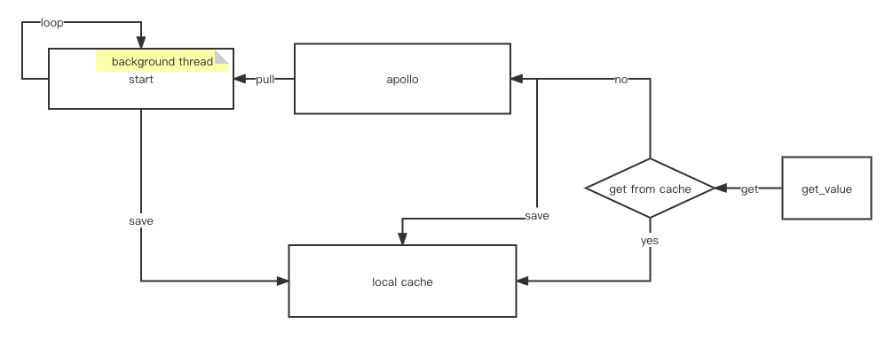

PyApollo - Python Client for Ctrip's Apollo
================

[](https://opensource.org/licenses/Apache-2.0)

基于Apollo配置中心框架 [Apollo](https://github.com/apolloconfig/apollo) 所开发的Python版本客户端。基于https://github.com/filamoon/pyapollo/ 修改，修复一些bug, 添加了新特效。 

# Architecture




# Installation
``` shell
pip install strengthen_apollo_client
```

# Fix Bug

* properties文件缓存失效问题
* 后台进程timeout shutdown问题

# Features

* 实时同步配置
* 本地缓存
* 支持properties,xml,json,yml,yaml格式


# Usage

- 启动客户端长连接监听

``` python
from pyapollo.strengthen_apollo_client import StrengthenApolloClient
client = StrengthenApolloClient(app_id=<appId>, cluster=<clusterName>, config_server_url=<configServerUrl>)
client.start()
```

- 获取Apollo的配置
  
```python
client.get_value(Key, DefaultValue)
```
